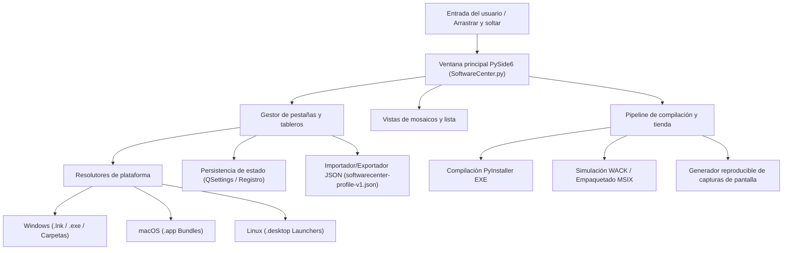
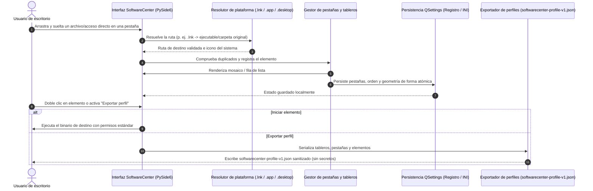

# SoftwareCenter

[](https://www.python.org/)
[](https://docs.pytest.org/)
[](https://github.com/file-bricks/SoftwareCenter)
[](SECURITY.md)
[](SECURITY.md)
[](LICENSE)
[](https://doc.qt.io/qtforpython-6/)
[](https://github.com/file-bricks)
[](https://github.com/open-bricks)
[](llms.txt)

[English](README.md) · [Deutsch](README_de.md) · [Español](README.es.md)

Un organizador de escritorio ligero y multiplataforma para gestionar accesos directos de software mediante categorización basada en pestañas.

> [!NOTE]
> **Integración de IA / LLM e índice legible por máquinas:** SoftwareCenter proporciona metadatos estructurados en [`llms.txt`](llms.txt) y admite migraciones de perfiles a través de JSON versionado (`softwarecenter-profile-v1.json`).


## Navegación rápida

- [Referencia rápida](#referencia-rápida)
- [Características](#características)
- [Arquitectura del sistema](#arquitectura-del-sistema)
- [Flujo del ciclo de vida](#flujo-del-ciclo-de-vida)
- [Capacidades centrales e invariantes de seguridad](#capacidades-centrales-e-invariantes-de-seguridad)
- [Ecosistema hermano y productos relacionados](#ecosistema-hermano-y-productos-relacionados)
- [Contexto de descubrimiento](#contexto-de-descubrimiento)
- [Requisitos](#requisitos)
- [Instalación](#instalación)
- [Ejecución](#ejecución)
- [Uso](#uso)
- [Compilar ejecutable](#compilar-ejecutable)
- [Controles de calidad](#controles-de-calidad)
- [Mantenimiento desatendido del catálogo](#mantenimiento-desatendido-del-catálogo)
- [Formato de intercambio](#formato-de-intercambio)
- [Límites de producto hermano](#límites-de-producto-hermano)
- [Activos de Windows Store](#activos-de-windows-store)
- [Pila tecnológica](#pila-tecnológica)
- [Política de seguridad](#política-de-seguridad)
- [Licencia](#licencia)
- [Responsabilidad](#responsabilidad)

## Referencia rápida

| Atributo | Detalles |
|---|---|
| **Pila tecnológica** | Python 3.10+ / PySide6 (Qt) / QSettings |
| **Licencia** | MIT (PySide6 vinculado dinámicamente bajo LGPLv3) |
| **Formato de intercambio** | `softwarecenter-profile-v1.json` (ver [EXPORTFORMAT.md](EXPORTFORMAT.md)) |
| **Última verificación** | 2026-09-11 (local: 223 pruebas, pruebas de plataforma, compileall, Ruff, auditoría de dependencias, integración con menús contextuales) |

## Características

- **Organización por pestañas** - Agrupa programas en pestañas renombrables y reorganizables
- **Arrastrar y soltar** - Añade archivos y accesos directos arrastrándolos a la ventana
- **Dos modos de vista** - Mosaicos (iconos grandes) y vista de lista compacta
- **Guardado automático** - Las pestañas, los contenidos y la geometría de ventana se guardan automáticamente
- **Menú contextual** - Clic derecho para abrir, editar notas o eliminar accesos directos
- **Multiplataforma** - Compatible de forma nativa con Windows, macOS y Linux
- **Iconos nativos** - Extracción y visualización automática de iconos de aplicaciones del sistema
- **Resolución de accesos directos en Windows** - Los archivos `.lnk` se resuelven al destino ejecutable o carpeta original
- **Paquetes de aplicaciones macOS** - Arrastra y suelta paquetes `.app` directamente en el organizador
- **Lanzadores de escritorio Linux** - Las entradas `.desktop` muestran su nombre real y se ejecutan mediante su comando nativo
- **Exportación e importación de perfiles** - Formato versionado `softwarecenter-profile-v1.json` para copias de seguridad y migraciones
- **Selección múltiple** - Eliminación masiva de accesos directos seleccionados
- **Local-First y sin telemetría** - Sin cuentas, sin servicios en la nube, sin recopilación de datos

## Arquitectura del sistema



## Flujo del ciclo de vida



## Capacidades centrales e invariantes de seguridad

| Invariante / Capacidad | Garantía arquitectónica | Mecanismo de verificación |
|---|---|---|
| **100% Local-First y Zero Egress** | Se ejecuta exclusivamente en el equipo local; cero telemetría, cero rastreo en la nube, sin llamadas remotas | Auditoría de código, comprobación offline en tiempo de ejecución, suite de pruebas |
| **Mínimo privilegio (Sin elevación)** | Opera estrictamente con permisos de usuario estándar; nunca solicita elevación UAC | Verificación del descriptor de seguridad del proceso |
| **Operaciones no destructivas** | Eliminar una entrada solo quita el metadato del acceso directo; nunca modifica ni borra archivos del disco | Pruebas de aislamiento de acción de borrado en UI |
| **Resolución segura de rutas** | Resuelve destinos `.lnk` de Windows, `.app` de macOS y `.desktop` de Linux sin invocar scripts de shell | Pruebas de contrato de resolución estática |
| **Persistencia de estado atómica** | QSettings guarda de forma segura la geometría, orden de pestañas y vista activa en el almacenamiento del SO | Suite de pruebas de persistencia de ida y vuelta |
| **Intercambio de perfiles sanitizado** | Exportación JSON validada (`softwarecenter-profile-v1.json`) que solo contiene rutas y etiquetas; sin credenciales | Pruebas de regresión en `tests/test_export_contract.py` |
| **Aislamiento de producto hermano** | Espacio de nombres QSettings independiente, mutex aislado e identidad propia entre SoftwareCenter y LaunchBoards | `scripts/verify_product_boundaries.py` |
| **Verificación Multi-SO en CI** | Validado en Python 3.10-3.12 en entornos Windows, macOS y Linux | Flujos de trabajo de GitHub Actions y pruebas de plataforma |

## Ecosistema hermano y productos relacionados

SoftwareCenter forma parte de la colección de herramientas de escritorio **file-bricks** y de la iniciativa de código abierto **open-bricks**:

| Proyecto | Ecosistema | Enfoque principal | Integración / Sinergia |
|---|---|---|---|
| [`ProFiler`](https://github.com/file-bricks/ProFiler) | `file-bricks` | Inspección de documentos y medios | Aplicación complementaria para perfilado forense de documentos |
| [`ExplorerPro`](https://github.com/file-bricks/ExplorerPro) | `file-bricks` | Explorador de archivos multipestaña | Gestión avanzada de archivos de doble panel para accesos directos de SoftwareCenter |
| [`CloudLockFixer`](https://github.com/file-bricks/CloudLockFixer) | `file-bricks` | Desbloqueo y reparación de bloqueos de nube | Desbloquea marcadores de posición de OneDrive referenciados en accesos directos |
| [`knowledgedigest`](https://github.com/file-bricks/knowledgedigest) | `file-bricks` | Base de conocimiento Markdown | Organizador de notas y síntesis para flujos de trabajo de investigación |
| [`FormularErstellen`](https://github.com/doc-bricks/FormularErstellen) | `doc-bricks` | Creación de plantillas y formularios | Generador de documentos de escritorio ejecutable mediante SoftwareCenter |
| [`USR_PDFunlock`](https://github.com/doc-bricks/USR_PDFunlock) | `doc-bricks` | Desbloqueo y gestión de PDF | Utilidad local no destructiva para documentos PDF |
| [`safe-start-for-codex`](https://github.com/dev-bricks/safe-start-for-codex) | `dev-bricks` | Control de inicio para automatizaciones | Protege las estaciones de trabajo de picos de carga durante el arranque |
| [`MethodenAnalyser`](https://github.com/dev-bricks/MethodenAnalyser) | `dev-bricks` | Analizador AST de código fuente | Análisis estático para módulos y aplicaciones de escritorio en Python |
| [`connectors`](https://github.com/ellmos-ai/connectors) | `ellmos-ai` | Puente de comunicación para agentes | Adaptadores de mensajería y transporte sin dependencias |
| [`open-bricks`](https://github.com/open-bricks) | `open-bricks` | Paraguas de código abierto de escritorio | Estándares, gobernanza y empaquetado común |

## Contexto de descubrimiento

SoftwareCenter se identifica principalmente como un **lanzador de aplicaciones local-first en PySide6** o un **organizador de accesos directos de escritorio**. Se sitúa entre el menú Inicio de Windows, las carpetas de accesos directos y los sistemas completos de inventario: inicia lo que ya está instalado en el equipo, agrupa accesos directos en pestañas y exporta/importa perfiles portátiles.

Frases de búsqueda útiles:

- `SoftwareCenter PySide6 desktop organizer`
- `local-first app launcher Python PySide6`
- `desktop shortcut organizer with tabs`
- `softwarecenter-profile-v1.json`
- `offline software launcher no cloud no telemetry`

No es Microsoft Configuration Manager Software Center, ni una tienda de aplicaciones, ni un gestor de paquetes de red, ni un portal de despliegue remoto.

## Requisitos

- Python 3.10+
- PySide6

## Instalación

```bash
pip install -r requirements.txt
```

## Ejecución

```bash
python SoftwareCenter.py
```

En Windows, también puede utilizar `START.bat` o el ejecutable precompilado `SoftwareCenter.exe` desde [Releases](https://github.com/file-bricks/SoftwareCenter/releases).

## Uso

| Acción | Instrucciones |
|--------|-------------|
| Añadir programas | Arrastre archivos, carpetas, accesos directos, paquetes `.app` en macOS o lanzadores `.desktop` en Linux a la ventana; los archivos `.lnk` de Windows se resuelven automáticamente a su destino original |
| Organizar pestañas | Barra de herramientas > "Nueva pestaña", doble clic para renombrar |
| Cambiar vista | Barra de herramientas > Mosaicos / Lista |
| Ejecutar programas | Doble clic o clic derecho > Abrir/Iniciar |
| Eliminar accesos directos | Clic derecho > Eliminar (elimina solo el acceso directo, no el archivo original) |
| Exportar perfil | `Archivo > Exportar perfil` o el botón en la barra de herramientas |
| Importar perfil | `Archivo > Importar perfil` o el botón en la barra de herramientas; sustituye el perfil actual |

## Compilar ejecutable

```bash
pip install pyinstaller
python -m PyInstaller --noconfirm --clean SoftwareCenter.spec
```

El archivo ejecutable se generará en `dist/SoftwareCenter.exe`. En Windows, `build_exe.bat` también lo copia a la raíz del proyecto para su uso local.

## Controles de calidad

```bash
python -m compileall -q SoftwareCenter.py manage_translations.py translator.py
python -m json.tool locales/translations.json
python -m json.tool store_package.json
python -m pytest -q
python tests/macos_platform_smoke.py
python tests/linux_platform_smoke.py
python scripts/verify_product_boundaries.py
```

El flujo de trabajo automatizado y su límite web opcional explícito están documentados en [CI_CONTRACT.md](CI_CONTRACT.md).

## Mantenimiento desatendido del catálogo

El reconciliador opcional de catálogo se proporciona como código de tiempo de ejecución Plan-D en `scripts/softwarecenter_sync.py`. Los archivos sincronizados de catálogo y registro son entradas explícitas de la CLI; el comando opera en modo solo lectura salvo que se especifique `--apply`. Los procedimientos de comprobación, lectura nativa y reversión están documentados en [RUNTIME_DAILY_CARE.md](RUNTIME_DAILY_CARE.md).

## Formato de intercambio

Los perfiles se pueden exportar como `softwarecenter-profile-v1.json` e importar posteriormente. El formato transporta pestañas, modos de vista y entradas con `label`, `path`, `kind` y notas opcionales, pero no copia archivos locales ni credenciales. Las rutas inexistentes permanecen visibles como referencias. Consulte [EXPORTFORMAT.md](EXPORTFORMAT.md) para más detalles.

## Límites de producto hermano

LaunchBoards comparte la implementación pero dispone de su propio espacio de nombres en QSettings, punto final de instancia única, icono, ejecutable, identidad en la Store y ciclo de versiones. Las comprobaciones estáticas reproducibles y de procesos paralelos aislados se documentan en [PRODUCT_BOUNDARIES.md](PRODUCT_BOUNDARIES.md).

## Activos de Windows Store

La vía de Windows Store incluye un generador reproducible de capturas de pantalla para la interfaz actual. Ejecute `python generate_store_screenshots.py` para regenerar las imágenes sanitizadas de la tienda y `summary.json` en `README/screenshots/store/`.

## Pila tecnológica

| Componente | Tecnología |
|-----------|-----------|
| Lenguaje | Python 3.10+ |
| Framework de interfaz | PySide6 (Qt para Python) |
| Almacenamiento | QSettings (Registro de Windows / INI) |
| Tamaño de código | ~690 líneas |

## Política de seguridad

La seguridad y la privacidad son prioridades arquitectónicas fundamentales. Consulte [SECURITY.md](SECURITY.md) para consultar nuestra política completa de divulgación de vulnerabilidades, el SLA de respuesta de 48 horas y las garantías locales.

## Licencia

[MIT](LICENSE)

**Nota:** Esta aplicación utiliza [PySide6](https://doc.qt.io/qtforpython-6/), bajo licencia LGPLv3. PySide6 se vincula de forma dinámica.

---

## Responsabilidad

Este proyecto es una contribución de código abierto no remunerada. La responsabilidad se limita a dolo y negligencia grave (§ 521 del Código Civil Alemán). Su uso es bajo su propia responsabilidad. Sin garantía ni compromiso de mantenimiento asumido.
