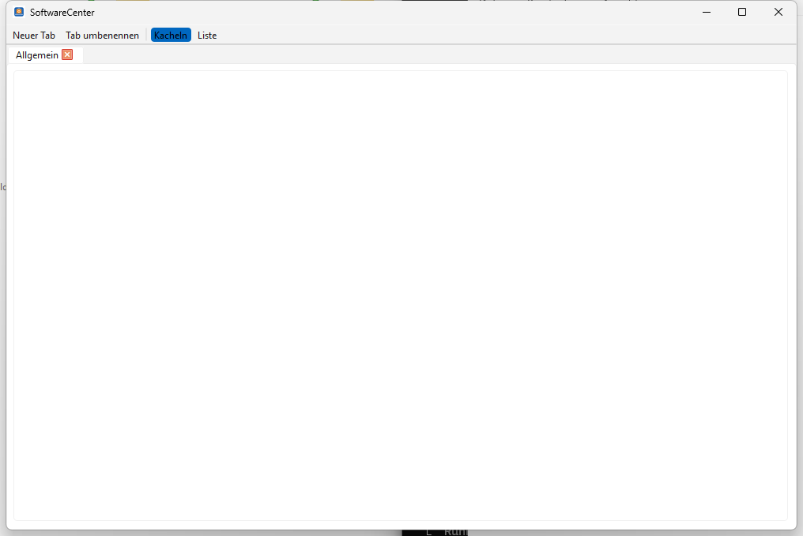

# SoftwareCenter

Ein leichtgewichtiger, plattformübergreifender Desktop-Organizer für Software-Verknüpfungen mit Tab-basierter Kategorisierung.



## Funktionen

- **Tab-Organisation** - Programme in benennbare, verschiebbare Tabs gruppieren
- **Drag & Drop** - Dateien per Drag & Drop hinzufügen
- **Zwei Ansichtsmodi** - Kacheln (große Icons) und Liste
- **Automatische Speicherung** - Tabs, Inhalte und Fensterposition bleiben erhalten
- **Kontextmenü** - Rechtsklick zum Öffnen oder Entfernen
- **Cross-Platform** - Windows, macOS und Linux
- **Native Icons** - Automatische Anzeige der System-Anwendungsicons
- **macOS-App-Bundles** - `.app`-Programme lassen sich per Drag & Drop hinzufügen
- **Linux-Desktop-Starter** - `.desktop`-Launcher werden mit ihrem App-Namen angezeigt und korrekt gestartet
- **Persistente Oberfläche** - Tabs, Fenstergröße und Ansichtsmodus werden via QSettings gespeichert
- **Profil-Export/Import** - Versioniertes Austauschformat `softwarecenter-profile-v1.json` für Migrationen und spätere Web/PWA-Companions
- **Web/PWA-Companion** - Statische `web_companion/`-Ansicht für mobile und browserbasierte Profilübersichten ohne Launcher-Rechte
- **Mehrfachauswahl** - Mehrere Einträge können gemeinsam gelöscht werden
- **Offline-first** - keine Telemetrie, keine Accounts, keine Cloud-Anbindung

## Voraussetzungen

- Python 3.10+
- PySide6

## Installation

```bash
pip install -r requirements.txt
```

## Starten

```bash
python SoftwareCenter.py
```

Unter Windows auch per `START.bat`. Für eine lokale EXE-Aktualisierung ist zusätzlich `build_exe.bat` vorhanden.

## Verwendung

| Aktion | Anleitung |
|--------|-----------|
| Programme hinzufügen | Dateien, Verknüpfungen, unter macOS `.app`-Bundles oder unter Linux `.desktop`-Starter ins Fenster ziehen |
| Tabs organisieren | Toolbar > "Neuer Tab", Doppelklick zum Umbenennen |
| Ansicht wechseln | Toolbar > Kacheln / Liste |
| Programme starten | Doppelklick oder Rechtsklick > Öffnen/Starten |
| Einträge entfernen | Rechtsklick > Löschen (entfernt nur die Verknüpfung) |
| Profil exportieren | `Datei > Profil exportieren` oder Toolbar-Aktion |
| Profil importieren | `Datei > Profil importieren` oder Toolbar-Aktion; ersetzt das aktuelle Profil |

## EXE erstellen

```bash
build_exe.bat

# oder direkt
python -m PyInstaller --noconfirm --clean SoftwareCenter.spec
```

Die EXE liegt anschließend in `dist/SoftwareCenter.exe` und wird durch `build_exe.bat` zusätzlich nach `SoftwareCenter.exe` im Projektwurzelverzeichnis kopiert.

## Qualitätssicherung

```bash
python -m compileall -q SoftwareCenter.py manage_translations.py translator.py
python -m json.tool locales/translations.json
python -m json.tool store_package.json
python -m pytest -q
python tests/linux_platform_smoke.py
```

Die GitHub Actions führen diese Smoke-Checks ebenfalls aus; der Linux-Job prüft zusätzlich `.desktop`-Import, `Exec`-/`xdg-open`-Startpfade, QSettings und den Profil-Export headless auf `ubuntu-latest`. Build-Artefakte wie `SoftwareCenter.exe`, `build/`, `dist/`, `releases/` und lokale Aufgaben-/Testdateien bleiben per `.gitignore` außerhalb des Repos.

## Austauschformat

Profile lassen sich als `softwarecenter-profile-v1.json` exportieren und wieder importieren. Das Format enthält Tabs, Ansichtsmodus und Einträge mit `label`, `path`, `kind` und optionalen `notes`, aber keine kopierten Dateien und keine Credentials. Details stehen in [EXPORTFORMAT.md](EXPORTFORMAT.md).

## Web/PWA-Companion

Unter [web_companion/README.md](web_companion/README.md) liegt jetzt ein statischer Companion für den Exportvertrag. Der Companion importiert `softwarecenter-profile-v1.json` lokal im Browser, zeigt Tabs und Eintragstypen filterbar an und hält den letzten Stand für Offline-Starts im Browser-Speicher vor.

## Technik

| Komponente | Technologie |
|------------|------------|
| Sprache | Python 3.10+ |
| GUI-Framework | PySide6 (Qt for Python) |
| Speicherung | QSettings (Windows Registry / INI) |
| Codeumfang | ~690 Zeilen |

---

## English

A lightweight, cross-platform desktop organizer for managing software shortcuts with tab-based categorization.

### Features

- **Tab Organization** - Group programs into renamable, movable tabs
- **Drag & Drop** - Add files via drag and drop
- **Two View Modes** - Tiles (large icons) and list
- **Auto Save** - Tabs, contents, and window position are persisted
- **Context Menu** - Right-click to open or remove
- **Cross-Platform** - Windows, macOS, and Linux
- **Native Icons** - Automatic display of system application icons
- **macOS App Bundles** - Drag and drop `.app` applications directly into the organizer
- **Linux Desktop Launchers** - `.desktop` entries show their app name and launch via their desktop command
- **Profile Export/Import** - Versioned `softwarecenter-profile-v1.json` format for migrations and future web/PWA companions
- **Web/PWA Companion** - Static `web_companion/` viewer for mobile and browser-based profile inspection without launcher permissions

### Requirements

- Python 3.10+
- PySide6

### Installation

```bash
pip install -r requirements.txt
```

### Run

```bash
python SoftwareCenter.py
```

On Windows, you can also use `START.bat` or the prebuilt `SoftwareCenter.exe` from the [Releases](https://github.com/file-bricks/SoftwareCenter/releases).

### Usage

| Action | Instructions |
|--------|-------------|
| Add programs | Drag files, shortcuts, `.app` bundles on macOS, or `.desktop` launchers on Linux into the window |
| Organize tabs | Toolbar > "New Tab", double-click to rename |
| Switch view | Toolbar > Tiles / List |
| Launch programs | Double-click or right-click > Open/Start |
| Remove entries | Right-click > Delete (removes shortcut only) |
| Export profile | `File > Export Profile` or the toolbar action |
| Import profile | `File > Import Profile` or the toolbar action; replaces the current profile |

### Build Executable

```bash
pip install pyinstaller
python -m PyInstaller --noconfirm --clean SoftwareCenter.spec
```

The EXE will be in `dist/SoftwareCenter.exe`. On Windows, `build_exe.bat` also copies it to the project root for local use.

### Quality Checks

```bash
python -m compileall -q SoftwareCenter.py manage_translations.py translator.py
python -m json.tool locales/translations.json
python -m json.tool store_package.json
python -m pytest -q
```

GitHub Actions runs these smoke checks. Build artifacts and local task/test files are ignored and should not be committed.

### Exchange Format

Profiles can be exported as `softwarecenter-profile-v1.json` and imported again later. The format carries tabs, view modes, and entries with `label`, `path`, `kind`, and optional `notes`, but does not copy local files or credentials. See [EXPORTFORMAT.md](EXPORTFORMAT.md) for details.

### Web/PWA Companion

The new [web_companion/README.md](web_companion/README.md) documents a static browser companion for the export format. It imports `softwarecenter-profile-v1.json` locally, offers tab/type filtering, and restores the last loaded profile for offline starts.

### Tech Stack

| Component | Technology |
|-----------|-----------|
| Language | Python 3.10+ |
| GUI Framework | PySide6 (Qt for Python) |
| Storage | QSettings (Windows Registry / INI) |
| Code Size | ~690 lines |

## License

[MIT](LICENSE)

**Hinweis / Note:** Diese Anwendung verwendet / This application uses [PySide6](https://doc.qt.io/qtforpython-6/), lizenziert unter / licensed under LGPLv3. PySide6 wird dynamisch gelinkt / is dynamically linked.

---

## Haftung / Liability

Dieses Projekt ist eine **unentgeltliche Open-Source-Schenkung** im Sinne der §§ 516 ff. BGB. Die Haftung des Urhebers ist gemäß **§ 521 BGB** auf **Vorsatz und grobe Fahrlässigkeit** beschränkt. Ergänzend gelten die Haftungsausschlüsse der MIT-Lizenz.

Nutzung auf eigenes Risiko. Keine Wartungszusage, keine Verfügbarkeitsgarantie, keine Gewähr für Fehlerfreiheit oder Eignung für einen bestimmten Zweck.

This project is an unpaid open-source donation. Liability is limited to intent and gross negligence (§ 521 German Civil Code). Use at your own risk. No warranty, no maintenance guarantee, no fitness-for-purpose assumed.

