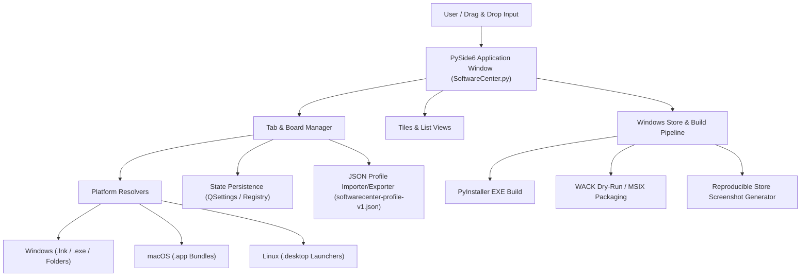
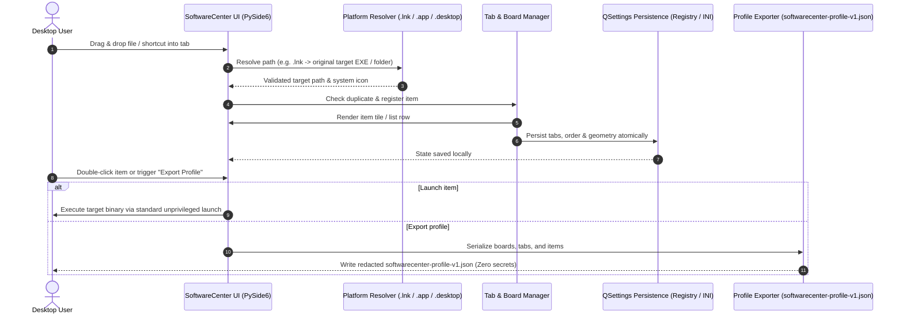

# SoftwareCenter

[](https://www.python.org/)
[](https://docs.pytest.org/)
[](https://github.com/file-bricks/SoftwareCenter)
[](SECURITY.md)
[](SECURITY.md)
[](LICENSE)
[](https://doc.qt.io/qtforpython-6/)
[](https://github.com/file-bricks)
[](https://github.com/open-bricks)
[](llms.txt)

[English](README.md) · [Deutsch](README_de.md) · [Español](README.es.md)

A lightweight, cross-platform desktop organizer for managing software shortcuts with tab-based categorization.

> [!NOTE]
> **LLM / AI Integration & Machine-Readable Index:** SoftwareCenter provides structured machine-readable metadata in [`llms.txt`](llms.txt) and supports profile migrations via versioned JSON (`softwarecenter-profile-v1.json`).


## Quick Navigation

- [Quick Reference](#quick-reference)
- [Features](#features)
- [Target Personas & Discoverability](#target-personas--discoverability)
- [Comparative Matrix vs. Alternatives](#comparative-matrix-vs-alternatives)
- [System Architecture](#system-architecture)
- [Lifecycle Sequence Flow](#lifecycle-sequence-flow)
- [Core Capabilities & Safety Invariants](#core-capabilities--safety-invariants)
- [Sibling Ecosystem & Sister Products](#sibling-ecosystem--sister-products)
- [Discovery Context](#discovery-context)
- [Requirements](#requirements)
- [Installation](#installation)
- [Run](#run)
- [Usage](#usage)
- [Build Executable](#build-executable)
- [Quality Checks](#quality-checks)
- [Headless Launcher Catalog Care](#headless-launcher-catalog-care)
- [Exchange Format](#exchange-format)
- [Sister-product boundary](#sister-product-boundary)
- [Windows Store Assets](#windows-store-assets)
- [Tech Stack](#tech-stack)
- [Security Policy](#security-policy)
- [Third-Party Licenses & Governance](#third-party-licenses--governance)
- [License](#license)
- [Liability](#liability)

## Quick Reference

| Attribute | Details |
|---|---|
| **Tech Stack** | Python 3.10+ / PySide6 (Qt) / QSettings |
| **License** | MIT (PySide6 dynamically linked under LGPLv3) |
| **Exchange Format** | `softwarecenter-profile-v1.json` (see [EXPORTFORMAT.md](EXPORTFORMAT.md)) |
| **Last Checked** | 2026-09-14 (local: full pytest suite, platform smokes, compileall, Ruff, dependency audit, file manager context menu integration; WACK remains dry-run only) |

## Features

- **Tab Organization** - Group programs, documents, and folders into renamable, movable boards
- **Drag & Drop & Universal Organizer** - Drop any apps, scripts, documents, folders, or shortcuts directly onto boards; acts as an independent organization layer over the filesystem
- **Empty-Board Guidance** - Helpful placeholder guidance on empty boards showing supported drop targets
- **Two View Modes** - Tiles (large icons) and list
- **Auto Save** - Tabs, contents, and window position are persisted
- **Context Menu** - Right-click to open or remove
- **Cross-Platform** - Windows, macOS, and Linux
- **Native Icons** - Automatic display of system application icons
- **Windows Shortcut Resolution** - Dropped `.lnk` files pointing to `.exe` or folder targets are stored as the original target
- **macOS App Bundles** - Drag and drop `.app` applications directly into the organizer
- **Linux Desktop Launchers** - `.desktop` entries show their app name and launch via their desktop command
- **Profile Export/Import** - Versioned `softwarecenter-profile-v1.json` format for migrations and backups
- **Multi-Selection** - Delete multiple entries at once
- **Offline-First** - No telemetry, no accounts, no cloud connection

## Target Personas & Discoverability

SoftwareCenter is designed to address specific workflow bottlenecks across four distinct user personas:

| Persona | Core Profile & Responsibilities | Key Pain Point | SoftwareCenter Solution |
|---|---|---|---|
| **Persona 1: Desktop Power Users & Curators** | Power users running dozens of tools, workspace folders, and utilities daily. | Cluttered Windows desktop, slow Start Menu search latency, lack of persistent custom grouping. | Fast tab-based boards, drag-and-drop file organization, custom notes, and instant switching. |
| **Persona 2: Solo Developers & DevOps Engineers** | Developers managing toolchains, CLI wrappers, portable apps, and virtual environments. | Mixing dev tools into consumer start menus; heavy launcher daemons consuming memory. | Isolated multi-profile identity, working directory preservation (`_startfile_in_dir`), zero daemon overhead. |
| **Persona 3: Multi-PC Workstation Operators** | Users synchronizing configurations across multiple workstations (e.g. Workstation and Laptop). | Hardcoded absolute paths, drive letter mismatches, and machine-local secret leakages. | Schema-validated export (`softwarecenter-profile-v1.json`), strict secret scrubbing, non-destructive import. |
| **Persona 4: Privacy-Conscious & Security Teams** | Security engineers and enterprise users requiring complete data confidentiality. | Commercial organizers with forced cloud accounts, telemetry, and background trackers. | 100% local-first offline execution (INV-LOCAL-01), zero network egress, unprivileged user rights (`RunAsInvoker`). |

### High-Intent Search Phrases

- `SoftwareCenter Python desktop launcher`
- `PySide6 desktop shortcut manager`
- `local-first desktop organizer python`
- `portable shortcut launcher without cloud account`
- `SoftwareCenter vs LaunchBoards profile switcher`
- `privacy friendly Windows app launcher with tabs`

## Comparative Matrix vs. Alternatives

| Capability / Dimension | SoftwareCenter | Windows Start Menu | Stardock Fences | SyMenu | Launchy / Flow Launcher |
|---|:---:|:---:|:---:|:---:|:---:|
| **Tab-Based Categorization** | **YES** (Dynamic Boards) | NO (Flat List / Folders) | YES (Desktop Fences) | YES (Hierarchical Menu) | NO (Search Box Only) |
| **Open Source (MIT License)** | **YES** (100% Permissive) | NO (Proprietary Bundled) | NO (Commercial Closed) | YES (Freeware Closed) | YES (Open Source) |
| **Zero Telemetry & 100% Offline** | **YES** (Strict Zero-Egress) | NO (Bing Search & Telemetry) | NO (License & Telemetry) | YES (Offline Capable) | PARTIAL (Plugin Network) |
| **Multi-Profile Separation** | **YES** (Dual-Identity Core) | NO (Single User Profile) | NO (Desktop Surface Only) | PARTIAL (Config Profiles) | NO (Single Configuration) |
| **Portable Redacted Profile Export** | **YES** (`softwarecenter-profile-v1.json`) | NO (Registry Dependent) | NO (Proprietary Backup) | PARTIAL (Custom XML) | NO (No Export Standard) |
| **Working Directory Preservation** | **YES** (Parent CWD Guaranteed) | PARTIAL (Variable CWD) | PARTIAL (Explorer Default) | YES (Configurable CWD) | PARTIAL (Launch Root CWD) |
| **Universal File/Doc/Folder Layer** | **YES** (Any FS Target / Droppable) | PARTIAL (Apps & Fixed Pins) | YES (Desktop Files) | YES (Menu Entries) | PARTIAL (Index Crawler) |
| **Headless Batch Catalog Care** | **YES** (Automated Reconciler) | NO (Interactive Only) | NO (Interactive Only) | NO (Manual GUI) | NO (Interactive Only) |
| **System Tray Quick Navigation** | **YES** (Integrated Tray Menu) | NO (Taskbar Fixed) | NO (Desktop Surface) | YES (Tray Centric) | NO (Keyboard Shortcut) |
| **Unprivileged Execution (`RunAsInvoker`)** | **YES** (Strict Non-Elevation) | SYSTEM / High Privilege | Standard User / Admin | Standard User | Standard User |

## System Architecture



## Lifecycle Sequence Flow



## Core Capabilities & Safety Invariants

| Invariant / Capability | Architecture Guarantee | Verification Mechanism |
|---|---|---|
| **100% Local-First & Zero Egress** | Runs entirely on the local machine; zero telemetry, zero cloud tracking, zero remote network calls | Source audit, offline runtime check, test suite |
| **Non-Elevation (Least Privilege)** | Operates strictly with unprivileged standard user rights; never requests UAC administrative elevation | Process security descriptor verification |
| **Non-Destructive Shortcut Operations** | Removing an entry only untracks shortcut metadata; never touches or deletes target executables or filesystem files | UI delete action isolation tests |
| **Safe Path & Link Resolution** | Resolves Windows `.lnk`, macOS `.app`, and Linux `.desktop` targets without invoking shell scripting | Static target resolution contract tests |
| **Atomic State Persistence** | QSettings safely flushes window geometry, tab order, and active view states to local OS storage | Atomic roundtrip persistence test suite |
| **Portable & Redacted Profile Exchange** | Schema-validated JSON (`softwarecenter-profile-v1.json`) export containing only paths and labels; zero credential extraction | `tests/test_export_contract.py` regression tests |
| **Sister-Product Isolation** | Separate QSettings namespace, mutex endpoint, and store identity between SoftwareCenter and LaunchBoards | `scripts/verify_product_boundaries.py` |
| **Multi-OS CI Matrix Verification** | Validated across Python 3.10-3.12 on Windows, macOS, and Linux runners | GitHub Actions workflows and smoke checks |

## Sibling Ecosystem & Sister Products

SoftwareCenter is part of the broader **file-bricks** desktop tools collection and the umbrella **open-bricks** open-source initiative:

| Project | Ecosystem | Primary Focus | Integration / Synergy |
|---|---|---|---|
| [`ProFiler`](https://github.com/file-bricks/ProFiler) | `file-bricks` | Document & media inspection | Companion app for file sorting and forensic document profiling |
| [`ExplorerPro`](https://github.com/file-bricks/ExplorerPro) | `file-bricks` | Multi-tab filesystem explorer | Complementary dual-pane file management for SoftwareCenter shortcuts |
| [`CloudLockFixer`](https://github.com/file-bricks/CloudLockFixer) | `file-bricks` | Cloud lock unlock & repair | Unlocks frozen sync placeholders and OneDrive files referenced by shortcuts |
| [`knowledgedigest`](https://github.com/file-bricks/knowledgedigest) | `file-bricks` | Markdown & document knowledge base | Local-first document digest organizer for research workflows |
| [`FormularErstellen`](https://github.com/doc-bricks/FormularErstellen) | `doc-bricks` | Form creation & templating | Desktop document generator launchable via SoftwareCenter tiles |
| [`USR_PDFunlock`](https://github.com/doc-bricks/USR_PDFunlock) | `doc-bricks` | PDF password & unlock tool | Non-destructive local PDF unlocking utility |
| [`safe-start-for-codex`](https://github.com/dev-bricks/safe-start-for-codex) | `dev-bricks` | Automation startup gate | Protects desktop workstation environments from startup surges |
| [`MethodenAnalyser`](https://github.com/dev-bricks/MethodenAnalyser) | `dev-bricks` | AST source code analyzer | Static analysis for Python desktop tools and modules |
| [`connectors`](https://github.com/ellmos-ai/connectors) | `ellmos-ai` | Agent communication bridge | Zero-dependency messaging and transport adapters |
| [`open-bricks`](https://github.com/open-bricks) | `open-bricks` | Desktop open-source umbrella | Standards, governance, and packaging umbrella |

## Discovery Context

SoftwareCenter is easiest to find as a **local-first PySide6 app launcher** or **desktop shortcut organizer**. It sits between the Windows Start menu, desktop shortcut folders, and full software inventory systems: it launches what is already on your machine, groups shortcuts into tabs, and exports/imports portable profiles.

Useful search phrases:

- `SoftwareCenter PySide6 desktop organizer`
- `local-first app launcher Python PySide6`
- `desktop shortcut organizer with tabs`
- `softwarecenter-profile-v1.json`
- `offline software launcher no cloud no telemetry`

It is not Microsoft Configuration Manager Software Center, an app store, a package manager, or a remote deployment portal.

## Requirements

- Python 3.10+
- PySide6

## Installation

```bash
pip install -r requirements.txt
```

## Run

```bash
python SoftwareCenter.py
```

On Windows, you can also use `START.bat` or the prebuilt `SoftwareCenter.exe` from the [Releases](https://github.com/file-bricks/SoftwareCenter/releases).

## Usage

| Action | Instructions |
|--------|-------------|
| Add programs | Drag files, folders, shortcuts, `.app` bundles on macOS, or `.desktop` launchers on Linux into the window; Windows `.lnk` files pointing to `.exe` files or folders are resolved to the original target |
| Organize tabs | Toolbar > "New Tab", double-click to rename |
| Switch view | Toolbar > Tiles / List |
| Launch programs | Double-click or right-click > Open/Start |
| Remove entries | Right-click > Delete (removes shortcut only) |
| Export profile | `File > Export Profile` or the toolbar action |
| Import profile | `File > Import Profile` or the toolbar action; replaces the current profile |

## Build Executable

```bash
pip install pyinstaller
python -m PyInstaller --noconfirm --clean SoftwareCenter.spec
```

The EXE will be in `dist/SoftwareCenter.exe`. On Windows, `build_exe.bat` also copies it to the project root for local use.

## Quality Checks

```bash
python -m compileall -q SoftwareCenter.py manage_translations.py translator.py
python -m json.tool locales/translations.json
python -m json.tool store_package.json
python -m pytest -q
python tests/macos_platform_smoke.py
python tests/linux_platform_smoke.py
python scripts/verify_product_boundaries.py
```

The hosted workflow and its explicit optional-web boundary are documented in
[CI_CONTRACT.md](CI_CONTRACT.md).

GitHub Actions runs these smoke checks. The macOS smoke validates `.app` import, `open` launching, QSettings persistence, and profile export on `macos-latest`; the Linux smoke covers `.desktop` import, `Exec`/`xdg-open` launching, QSettings persistence, and profile export on `ubuntu-latest`. Build artifacts and local task/test files are ignored and should not be committed.

For the Windows Store path, `python scripts/run_windows_wack.py --dry-run` checks the local MSIX/AppCert paths and prints the reproducible WACK command. The real certification run should be executed from an elevated PowerShell against a fresh signed MSIX before submission.
`python generate_store_screenshots.py` creates the reproducible Store screenshot set under `README/screenshots/store/`.

## Headless Launcher Catalog Care

The optional catalog reconciler is provided as Plan-D runtime code in
`scripts/softwarecenter_sync.py`. Synchronized catalog and registry files are
explicit CLI inputs; the command is read-only unless `--apply` is supplied.
The pinned-runtime scheduler payload, apply gates, native readback, and rollback
procedure are documented in [RUNTIME_DAILY_CARE.md](RUNTIME_DAILY_CARE.md).

## Exchange Format

Profiles can be exported as `softwarecenter-profile-v1.json` and imported again later. The format carries tabs, view modes, and entries with `label`, `path`, `kind`, and optional `notes`, but does not copy local files or credentials. Missing paths remain visible as references. See [EXPORTFORMAT.md](EXPORTFORMAT.md) for details.

## Sister-product boundary

LaunchBoards shares the implementation but has its own QSettings namespace,
single-instance endpoint, icon, executable, Store identity, and release path.
The reproducible static, isolated parallel-process, and artifact checks are
documented in [PRODUCT_BOUNDARIES.md](PRODUCT_BOUNDARIES.md).

## Windows Store Assets

The Windows Store track now includes a reproducible screenshot generator for the
current desktop UI. Run `python generate_store_screenshots.py` to refresh
`README/screenshots/store/` with four redacted Store images and `summary.json`.

## Tech Stack

| Component | Technology |
|-----------|-----------|
| Language | Python 3.10+ |
| GUI Framework | PySide6 (Qt for Python) |
| Storage | QSettings (Windows Registry / INI) |
| Code Size | ~690 lines |

## Security Policy

Security and privacy are core architectural priorities. See [SECURITY.md](SECURITY.md) for our full vulnerability disclosure guidelines, 48-hour response SLA, and local-first invariants.

## Third-Party Licenses & Governance

SoftwareCenter incorporates third-party open-source components under compliant, permissive licensing. Complete audit details, SPDX identifiers, and dynamic linking compliance statements are available in [THIRD_PARTY_LICENSES.md](THIRD_PARTY_LICENSES.md).

- **PySide6 & shiboken6:** [LGPL-3.0-only](https://www.gnu.org/licenses/lgpl-3.0.html) (dynamically linked via Qt for Python, preserving full user replaceability under LGPLv3 §4).
- **Python Standard Library:** [PSF-2.0](https://docs.python.org/3/license.html) (100% offline, zero network egress).
- **PyInstaller:** [GPL-2.0-or-later with PyInstaller-exception](https://pyinstaller.org/en/stable/license.html) (build-time tooling; output executables are exempt from GPL copyleft).
- **Governance Invariants:** 10 core runtime guarantees (INV-LOCAL-01 through INV-ZEROCOPY-10) enforced by automated tests.

## License

[MIT](LICENSE)

**Note:** This application uses [PySide6](https://doc.qt.io/qtforpython-6/), licensed under LGPLv3. PySide6 is dynamically linked.

---

## Liability

This project is an unpaid open-source donation. Liability is limited to intent and gross negligence (§ 521 German Civil Code). Use at your own risk. No warranty, no maintenance guarantee, no fitness-for-purpose assumed.
