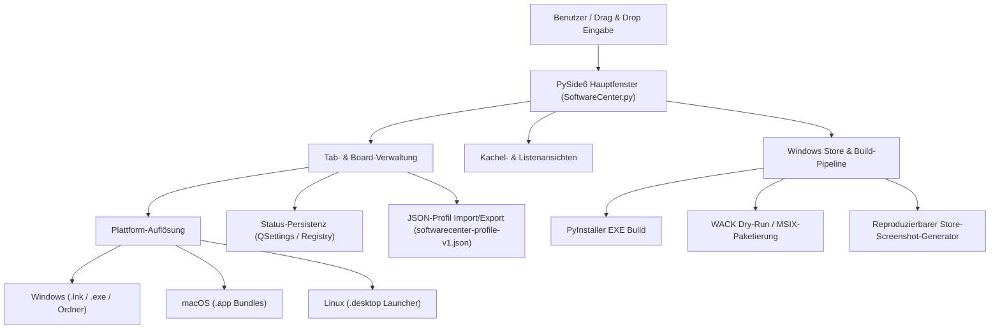

# SoftwareCenter

[](https://www.python.org/)
[](https://docs.pytest.org/)
[](LICENSE)
[](https://doc.qt.io/qtforpython-6/)
[](https://github.com/file-bricks)
[](https://github.com/open-bricks)
[](llms.txt)

Ein leichtgewichtiger, plattformübergreifender Desktop-Organizer für Software-Verknüpfungen mit Tab-basierter Kategorisierung.

> [!NOTE]
> **KI / LLM Integration & Maschinelles Register:** SoftwareCenter bietet maschinenlesbare Metadaten in [`llms.txt`](llms.txt) und unterstützt Profil-Migrationen über versioniertes JSON (`softwarecenter-profile-v1.json`).

[English Documentation](README.md)


## Einstieg

| Eigenschaft | Details |
|---|---|
| **Tech Stack** | Python 3.10+ / PySide6 (Qt) / QSettings |
| **Lizenz** | MIT (PySide6 dynamisch gelinkt unter LGPLv3) |
| **Austauschformat** | `softwarecenter-profile-v1.json` (siehe [EXPORTFORMAT.md](EXPORTFORMAT.md)) |
| **Letzte Prüfung** | 2026-08-04 (MAINTAINER-Health-Check: 161 Tests, Plattform-Smokes, Compileall, JSON, WACK-Dry-Run) |

## Funktionen

- **Tab-Organisation** - Programme in benennbare, verschiebbare Tabs gruppieren
- **Drag & Drop** - Dateien per Drag & Drop hinzufügen
- **Zwei Ansichtsmodi** - Kacheln (große Icons) und Liste
- **Automatische Speicherung** - Tabs, Inhalte und Fensterposition bleiben erhalten
- **Kontextmenü** - Rechtsklick zum Öffnen oder Entfernen
- **Cross-Platform** - Windows, macOS und Linux
- **Native Icons** - Automatische Anzeige der System-Anwendungsicons
- **Windows-Verknüpfungen** - `.lnk`-Dateien mit `.exe`- oder Ordnerziel werden beim Hinzufügen als Originalziel gespeichert
- **macOS-App-Bundles** - `.app`-Programme lassen sich per Drag & Drop hinzufügen
- **Linux-Desktop-Starter** - `.desktop`-Launcher werden mit ihrem App-Namen angezeigt und korrekt gestartet
- **Profil-Export/Import** - Versioniertes Austauschformat `softwarecenter-profile-v1.json` für Migrationen und Backups
- **Mehrfachauswahl** - Mehrere Einträge können gemeinsam gelöscht werden
- **Offline-first** - keine Telemetrie, keine Accounts, keine Cloud-Anbindung

## Systemarchitektur



## Auffindbarkeit

SoftwareCenter ist am besten als **lokaler PySide6-App-Launcher** oder **Desktop-Shortcut-Organizer** einzuordnen. Das Tool liegt zwischen Windows-Startmenü, Desktop-Verknüpfungsordnern und großen Software-Inventarsystemen: Es startet vorhandene Programme, gruppiert Verknüpfungen in Tabs und exportiert/importiert portable Profile.

Nützliche Suchphrasen:

- `SoftwareCenter PySide6 Desktop Organizer`
- `lokaler App Launcher Python PySide6`
- `Desktop Verknüpfungen in Tabs organisieren`
- `softwarecenter-profile-v1.json`
- `Offline Software Launcher ohne Cloud ohne Telemetrie`

Es ist nicht Microsoft Configuration Manager Software Center, kein App Store, kein Paketmanager und kein Remote-Deployment-Portal.

## Voraussetzungen

- Python 3.10+
- PySide6

## Installation

```bash
pip install -r requirements.txt
```

## Starten

```bash
python SoftwareCenter.py
```

Unter Windows auch per `START.bat`. Für eine lokale EXE-Aktualisierung ist zusätzlich `build_exe.bat` vorhanden.

## Verwendung

| Aktion | Anleitung |
|--------|-----------|
| Programme hinzufügen | Dateien, Ordner, Verknüpfungen, unter macOS `.app`-Bundles oder unter Linux `.desktop`-Starter ins Fenster ziehen; Windows-`.lnk`-Dateien mit `.exe`- oder Ordnerziel werden auf das Originalziel aufgelöst |
| Tabs organisieren | Toolbar > "Neuer Tab", Doppelklick zum Umbenennen |
| Ansicht wechseln | Toolbar > Kacheln / Liste |
| Programme starten | Doppelklick oder Rechtsklick > Öffnen/Starten |
| Einträge entfernen | Rechtsklick > Löschen (entfernt nur die Verknüpfung) |
| Profil exportieren | `Datei > Profil exportieren` oder Toolbar-Aktion |
| Profil importieren | `Datei > Profil importieren` oder Toolbar-Aktion; ersetzt das aktuelle Profil |

## EXE erstellen

```bash
build_exe.bat

# oder direkt
python -m PyInstaller --noconfirm --clean SoftwareCenter.spec
```

Die EXE liegt anschließend in `dist/SoftwareCenter.exe` und wird durch `build_exe.bat` zusätzlich nach `SoftwareCenter.exe` im Projektwurzelverzeichnis kopiert.

## Qualitätssicherung

```bash
python -m compileall -q SoftwareCenter.py manage_translations.py translator.py
python -m json.tool locales/translations.json
python -m json.tool store_package.json
python -m pytest -q
python tests/macos_platform_smoke.py
python tests/linux_platform_smoke.py
```

Die GitHub Actions führen diese Smoke-Checks ebenfalls aus; der macOS-Job prüft `.app`-Import, `open`-Startpfad, QSettings und den Profil-Export headless auf `macos-latest`, der Linux-Job zusätzlich `.desktop`-Import, `Exec`-/`xdg-open`-Startpfade, QSettings und den Profil-Export auf `ubuntu-latest`. Build-Artefakte wie `SoftwareCenter.exe`, `build/`, `dist/`, `releases/` und lokale Aufgaben-/Testdateien bleiben per `.gitignore` außerhalb des Repos.

Für den Windows-Store-Pfad prüft `python scripts/run_windows_wack.py --dry-run` die lokalen MSIX/AppCert-Pfade und gibt den reproduzierbaren WACK-Befehl aus. Der eigentliche Zertifizierungslauf sollte aus einer erhöhten PowerShell gegen ein frisch signiertes MSIX vor der Einreichung ausgeführt werden.

## Headless-Katalogpflege

Die optionale Katalogroutine liegt als Plan-D-Runtime-Code unter
`scripts/softwarecenter_sync.py`. Synchronisierte Katalog- und Registry-Dateien
werden als explizite CLI-Eingaben übergeben; ohne `--apply` bleibt der Lauf
read-only. Der gepinnte Scheduler-Payload, Apply-Gates, native Readbacks und das
Rollback stehen in [RUNTIME_DAILY_CARE.md](RUNTIME_DAILY_CARE.md).

## Austauschformat

Profile lassen sich als `softwarecenter-profile-v1.json` exportieren und wieder importieren. Das Format enthält Tabs, Ansichtsmodus und Einträge mit `label`, `path`, `kind` und optionalen `notes`, aber keine kopierten Dateien und keine Credentials. Details stehen in [EXPORTFORMAT.md](EXPORTFORMAT.md).

## Technik

| Komponente | Technologie |
|------------|------------|
| Sprache | Python 3.10+ |
| GUI-Framework | PySide6 (Qt for Python) |
| Speicherung | QSettings (Windows Registry / INI) |
| Codeumfang | ~690 Zeilen |

## Lizenz

[MIT](LICENSE)

**Hinweis:** Diese Anwendung verwendet [PySide6](https://doc.qt.io/qtforpython-6/), lizenziert unter LGPLv3. PySide6 wird dynamisch gelinkt.

---

## Haftung

Dieses Projekt ist eine **unentgeltliche Open-Source-Schenkung** im Sinne der §§ 516 ff. BGB. Die Haftung des Urhebers ist gemäß **§ 521 BGB** auf **Vorsatz und grobe Fahrlässigkeit** beschränkt. Ergänzend gelten die Haftungsausschlüsse der MIT-Lizenz.

Nutzung auf eigenes Risiko. Keine Wartungszusage, keine Verfügbarkeitsgarantie, keine Gewähr für Fehlerfreiheit oder Eignung für einen bestimmten Zweck.
